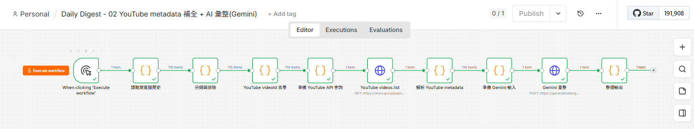

# Pensieve — 個人每日數位足跡彙整 AI Agent

> 自動蒐集每日 YouTube 觀看紀錄與瀏覽文章，透過 AI 彙整分類後寫入 Obsidian 每日筆記；
> 後續將擴充為可互動討論學習規劃、新聞時事、工作任務的個人 AI Agent。

---

## 專案目標

現代人每天瀏覽大量網頁與影片，但內容容易看完即忘、難以回顧與延伸思考。
本專案的目標分兩階段：

- **Phase 1（MVP，已完成）**：每天自動彙整「我今天看了什麼」
  - 從瀏覽器歷史擷取當日 YouTube 觀看紀錄與瀏覽文章
  - 用 AI 分類、摘要、找出跨項目的觀察與洞察
  - 產出 Markdown 報告寫入 Obsidian vault
- **Phase 2（已完成）**：互動式 AI Agent
  - 以 `MEMORY.md`（長期記憶）+ 每日彙整 daily notes 作為 context
  - Telegram Bot 互動問答 + 每日摘要主動推播
- **Phase 3（已完成）**：自動化擴充
  - 全域錯誤監控告警（n8n Error Trigger + Telegram）
  - 學習吸收模組：YouTube/網頁/PDF 連結 → AI 摘要、整理寫入 Obsidian

---

## 技術棧

| 層次 | 技術 | 說明 |
|---|---|---|
| 自動化平台 | [n8n](https://n8n.io/)（Self-hosted, Docker） | Workflow 編排、排程、HTTP 呼叫 |
| 容器化 | Docker / Docker Compose | 單一 `n8n` 服務，含自訂 Dockerfile |
| 瀏覽器歷史查詢 | SQLite3 CLI | 讀取 Chrome / Edge `History` SQLite 資料庫 |
| YouTube metadata | YouTube Data API v3（`videos.list`） | 補全標題、頻道、分類、時長 |
| AI 彙整 | Google Gemini API（`gemini-2.5-flash`） | 分類、摘要、產生洞察（取代原規劃的 Claude API，成本考量） |
| 筆記輸出 | Obsidian Vault（本機 volume mount） | 每日 Markdown 報告 |
| 開發協作 | Claude Code | 跨對話維持開發脈絡與進度追蹤 |
| 依賴管理 | [Poetry](https://python-poetry.org/) | Phase 2 互動式 Agent（`pensieve`）的 Python 開發環境 |

---

## 架構總覽

```
┌──────────────────────────────────────────────────────────┐
│  Windows 主機                                              │
│                                                            │
│  Chrome/Edge History (唯讀)   Obsidian Vault (讀寫)        │
│         │                              ▲                  │
│         ▼                              │                  │
│  ┌──────────────────────────────────────────────────┐    │
│  │  n8n (Docker, restart: unless-stopped)            │    │
│  │                                                    │    │
│  │  讀取瀏覽器歷史 → 分類與排除 → videoId 去重        │    │
│  │       → YouTube videos.list（補 metadata）         │    │
│  │       → Gemini 彙整（分類/摘要/洞察）              │    │
│  │       → 整理輸出 → 寫入 Obsidian Daily/            │    │
│  └──────────────────────────────────────────────────┘    │
└──────────────────────────────────────────────────────────┘
```

---

## 快速開始

### 前置需求

| 工具 | 用途 |
|---|---|
| Docker Desktop | 執行 n8n 容器，需設定 WSL2 backend 與 file sharing |
| Google Cloud Console 帳號 | 申請 YouTube Data API Key |
| Google AI Studio 帳號 | 申請 Gemini API Key |
| Obsidian | 檢視每日彙整報告（非必要，純檔案輸出） |

### 啟動步驟

```powershell
# 1. 複製環境變數範本並設定加密金鑰
cp .env.example .env
# 編輯 .env，填入 N8N_ENCRYPTION_KEY（建議用 openssl rand -hex 32 產生）

# 2. 建置並啟動 n8n（含 sqlite3 CLI 的客製化映像）
docker compose up -d --build

# 3. 開啟 n8n
# http://localhost:5678 → 完成 owner 帳號設定
```

接著在 n8n Web UI 設定 Credentials：

1. **Settings → Credentials → New → Query Auth**
   - `YouTube Data API`：Query Parameter 設為 `key`，Value 填入 YouTube Data API v3 Key
   - Gemini API：另建一組 Query Auth，Value 填入 Google AI Studio 申請的 API Key
2. 匯入 `workflows/02_youtube_metadata_summary.json`，並將上述兩組 credentials 綁定到對應的 HTTP Request 節點（`YouTube videos.list`、`Gemini 彙整`）

> ⚠️ `docker-compose.yml` 中的 volume 路徑（Chrome/Edge History、Obsidian vault）透過 `.env` 設定
>（範本見 `.env.example`），換機器或換使用者時只需更新 `.env`，不需修改 `docker-compose.yml`。

### pensieve（互動式 Agent）設定

Phase 2/3 的 Telegram 互動 Bot 是獨立於 n8n 的 Python 服務，需另外設定：

**前置需求**

| 工具 | 用途 |
|---|---|
| Python 3.13（建議用 [uv](https://docs.astral.sh/uv/) 安裝指定版本，不依賴系統內建版本） | 執行 `pensieve` 服務 |
| [Poetry](https://python-poetry.org/) | 管理 Python 依賴 |
| Telegram 帳號 | 透過 [@BotFather](https://t.me/BotFather) 申請屬於你自己的 Bot Token |

**設定步驟**

```bash
# 1. 安裝指定版本 Python（避免系統版本不符合 pyproject.toml 的 >=3.13,<3.14 限制）
uv python install 3.13

# 2. 建立虛擬環境並交給 Poetry 管理
$(uv python find 3.13) -m venv .venv
poetry env use ./.venv/bin/python
poetry install
```

接著編輯 `.env`，填入以下欄位（範本見 `.env.example` 的「Phase 2：互動式 AI Agent」區塊）：

- `TELEGRAM_BOT_TOKEN`：跟 [@BotFather](https://t.me/BotFather) 對話 `/newbot` 取得
- `TELEGRAM_CHAT_ID`：你自己跟剛建立的 Bot 對話後，透過 `https://api.telegram.org/bot<TOKEN>/getUpdates` 可查到的 chat id
- `GEMINI_API_KEY`：可沿用申請 n8n 用的同一把 Gemini API Key
- `OBSIDIAN_VAULT_PATH`：跟 `.env` 給 n8n 用的同一個 Obsidian vault 路徑

手動啟動測試：

```bash
poetry run python -m pensieve.main
```

成功啟動後，在 Telegram 跟你的 Bot 對話即可互動問答；傳送 YouTube/網頁連結或 PDF 檔案會觸發學習吸收模組。

> ⚠️ `pensieve` 用 Telegram **long-polling** 收訊息，同一個 Bot Token **只能有一個地方在跑**，
> 兩邊同時執行會被 Telegram 判定 `409 Conflict`。開發測試時建議另外申請一個獨立的測試 Bot，
> 不要拿正式使用的 Bot Token 重複啟動。

**常駐執行（依你的作業系統選擇）**

`pensieve` 本身沒有內建排程器，需要交給作業系統的服務機制讓它開機自動啟動、當機自動重啟：

- **Linux / WSL（systemd）**：`scripts/pensieve.service` 是現成範本，但 `User`/`WorkingDirectory`/`ExecStart` 是機器專屬路徑，套用前請先改成你自己的使用者與專案路徑，再 `sudo cp` 到 `/etc/systemd/system/` 並 `systemctl enable --now pensieve`
- **Windows**：用工作排程器（Task Scheduler）註冊一個登入時啟動、失敗自動重試的工作，執行 `poetry run python -m pensieve.main`
- **macOS**：用 `launchd`，建立對應的 `.plist` 並 `launchctl load`

---

## 目前進度

### Phase 1：每日數位足跡彙整（MVP）— 已完成

- ✅ Docker 化 n8n（含 sqlite3 CLI 客製化映像）+ `docker-compose.yml` / `.env`
- ✅ 讀取並分類瀏覽器歷史（YouTube 觀看紀錄 / 瀏覽文章），含 videoId 去重與音樂內容排除
- ✅ YouTube metadata 補全（YouTube Data API）+ Gemini 彙整（分類、摘要、洞察）
- ✅ 輸出 Markdown 報告至 Obsidian `Daily/`，並設定排程（23:30）與近 7 天補跑邏輯
- ✅ 專案命名 Pensieve、建立 Poetry 環境、上傳至 GitHub（Public）


### Phase 2：互動式 AI Agent — 已完成

- ✅ `MEMORY.md`（長期記憶，唯讀）+ 近 N 天 daily notes context 載入機制
- ✅ Gemini 互動問答（Telegram Bot `@pensieve_ag_bot`，長輪詢，不需對外 webhook）
- ✅ 每日摘要主動推播（23:45 / 23:55 Asia/Taipei）+ `/digest` 手動觸發指令

### Phase 3：自動化擴充 — 已完成

- ✅ 全域錯誤監控告警：n8n Error Trigger → Telegram，主要 workflow 執行失敗時即時通知
- ✅ pensieve 常駐化與自我監控：開機自動啟動、心跳檔、推播狀態紀錄與補推播
- ✅ 學習吸收模組：YouTube / 網頁 / PDF 連結 → AI 摘要、整理寫入 Obsidian `Learn/`，並依主題建立硬連結子資料夾
- ✅ `/memory_update` 指令：根據近期 daily notes + 學習筆記，由 Gemini 產生 `MEMORY.md` 更新草稿，Telegram inline 按鈕確認後直接寫回 vault


---

## 授權

個人 Side Project，目前僅供自用，未設定公開授權條款。
